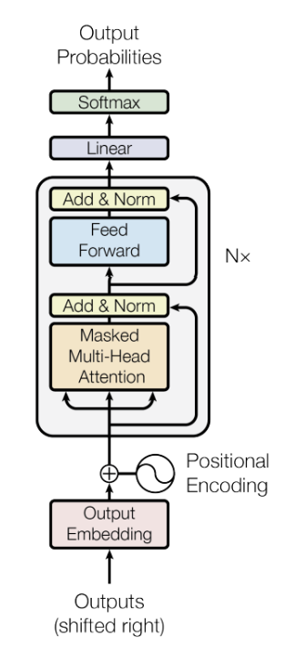

# GPT From Scratch (PyTorch)

## Overview 

This repository contains code-implementation of a **GPT-style Language Model** from the ground-breaking research paper **"Attention is All you Need":**

The goal is to demonstrate deep understanding of: 
- **Tokenization and Vocabulary Creation**
- **Token Embeddings and Position Embeddings**
- **Causal (Masked) Self-Attention**
- **Transformer Blocks** 
- **Training the Model to Predict the Next token**
- **Autoregressive Text Generation**

All of these are implemented in the notebook without using high-level Transformer libraries.

## What this project Demonstrates 
- Word-level Tokenization
- Encoding text into a continous token stream
- Causal Langual Modelling by shifting targets
- Masked Self Attention (Single Head and Multi Head)
- Feed Forward Neural Network for token wise computation
- Residual Connection and Layer Normalization
- Combining (MSA + FFN + Residual Connection + LayerNorm + Vocab Projection) to form GPT
- Training Loop
- Autoregressive Generation with strict `<END>` stopping

## Architecture 

The model follows standard GPT Architecture: 
- **Token Embeddings + Positional Embeddings**
- **Transformer Blocks - Multihead Self Attention + Feed Forward Neural Network + Residual Connections + Layer Norm**
- **Final Layer Normalization**
- **Final Vocabulary Projection Head**

<!-- 📌 Diagram 1: Full GPT Architecture --> <p align="center">  </p>

This implementation Exactly Replicates the model architecture or the original GPT while keeping its component transparent and readable.

## Dataset 

To keep the training fast and interpretable , the model is trained on a Tiny text corpus containing some hand written sentences with repeated structure.

This allows to demonstrate the language model clearly while using the same pipeline which is can be scaled to larger real-world dataset.

An `<END>` token is appended to each sentence and used during generation to break generation of the text.

## Training Objective 

The model is trained using CrossEntropy loss , the standard for next token prediction.

Due to small dataset , the rapid loss convergence serves as an indicator of the model correctness rather than language quality.

## Sample Generation 

After Training , the model generate text autoregressively by predicting one token at a time using Masked Self Attention.

**Prompt :**
```
"I  love"
```
**Model Output**
```
"I love deep learning . "
```
Text generation stops automatically when the <END> token is produced.

## Tech Stack 
- Python
- PyTorch
- Jupyter Notebook (Google Colab)

## Notes :
- This project is educational and not meant for production deployement.
- The dataset is intentionally small to highlight model learning and easier debugging.
- The main focus is to replicate the model architecture , it's interpretability and correctness.

This project was built to deeply understand how the GPT-style model works internally from raw text to token-by-token generation, without treating Transformer as a blackbox.


